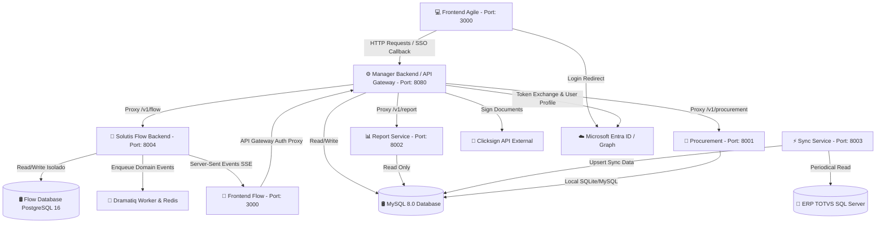

# Arquitetura do Sistema - Solutis Agile

## Diagrama de Microsserviços

## Mapeamento de Portas e Serviços Locais e Produção

- **Frontend Principal (`solutis-agile-frontend`)**: `http://localhost:3000` (Porta 3000 no host / porta 80 interna no container)
- **Frontend TaskView (`solutis-flow`)**: `http://localhost:3001` (Porta 3001 no host / porta 80 interna no container)
- **Manager Backend (Core API & Auth Proxy Gateway)**: `http://localhost:8080` (Docs em `/docs`)
- **Procurement**: `http://localhost:8001` (Admin Django em `/admin`)
- **Report Service**: `http://localhost:8002` (Docs em `/docs`)
- **Sync Service**: `http://localhost:8003` (Docs em `/docs`)
- **Solutis Flow Backend**: `http://localhost:8004` (Docs em `/api/v1/docs`)
- **Solutis Flow Database (PostgreSQL 16)**: `localhost:5432`
- **Solutis Flow Redis (Redis 7)**: `localhost:6379`

## Fluxos de Dados e Integrações
1. **Manager Backend (Core & Gateway)**: Gerencia CRUD de ativos e comodatos, centraliza o login unificado com autenticação JWT/Token e suporte a Single Sign-On (SSO) corporativo com Microsoft Entra ID (Azure AD) sob Feature Flag (`ENABLE_SSO` / `VITE_ENABLE_SSO` com default `false`), atua como API Gateway/Auth Proxy roteando chamadas e injetando o contexto do usuário nos microsserviços downstream.
2. **Solutis Flow Backend**: Microsserviço de governança operacional e gestão de demandas com arquitetura baseada em eventos (Dramatiq + Redis), SSE em tempo real, banco de dados isolado e referências a usuários via IDs inteiros indexados.
3. **Sync Service**: Executa tarefas agendadas (APScheduler) para puxar dados do ERP TOTVS (SQL Server) e efetuar upsert no MySQL.
4. **Report Service**: Consome o MySQL em modo somente leitura e gera relatórios em planilhas Excel (.xlsx).
5. **Procurement**: Serviço de compras e fornecedores baseado em Django com suporte ASGI, NinjaAPI e Pydantic, gerenciando o ciclo de vida de fornecedores e o módulo de Análise e Decisão de Compras (FO-AD-01).

