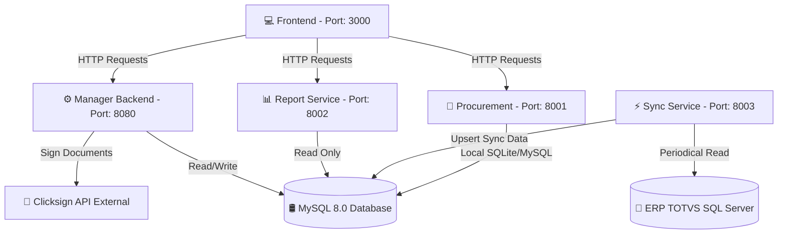

# Arquitetura do Sistema - Solutis Agile

## Diagrama de Microsserviços

## Mapeamento de Portas e Serviços Locais

- **Frontend**: `http://localhost:3000`
- **Manager Backend (Core API)**: `http://localhost:8080` (Docs em `/docs`)
- **Procurement**: `http://localhost:8001` (Admin Django em `/admin`)
- **Report Service**: `http://localhost:8002` (Docs em `/docs`)
- **Sync Service**: `http://localhost:8003` (Docs em `/docs`)

## Fluxos de Dados e Integrações
1. **Manager Backend (Core)**: Gerencia CRUD de ativos e comodatos, integrando com Clicksign para assinatura de documentos e salvando estado no MySQL.
2. **Sync Service**: Executa tarefas agendadas (APScheduler) para puxar dados do ERP TOTVS (SQL Server) e efetuar upsert no MySQL.
3. **Report Service**: Consome o MySQL em modo somente leitura e gera relatórios em planilhas Excel (.xlsx) via arquitetura hexagonal.
4. **Procurement**: Serviço de fornecedores baseado em Django com suporte ASGI e Pydantic.
