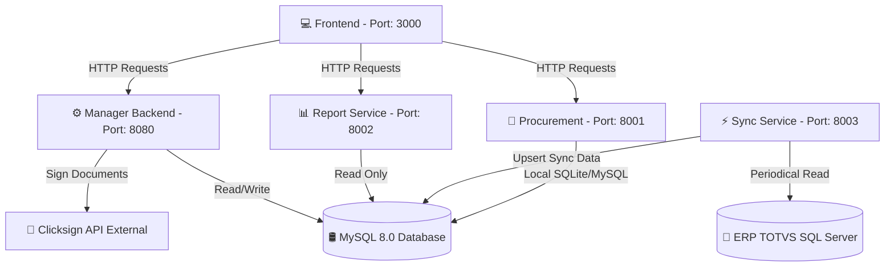

# 🚀 Solutis Agile - Monorepo

Bem-vindo ao monorepo **Solutis Agile**. Este repositório centraliza todos os microsserviços, o portal frontend e os utilitários que compõem o ecossistema de gestão, automação de comodatos e relacionamento com fornecedores da Solutis.

---

## 🗺️ Navegação da Documentação

Abaixo estão os links diretos para a documentação detalhada de cada componente deste monorepo. Recomendamos ler o README específico de cada serviço para entender os requisitos locais e instruções de inicialização individual:

| Componente | Função | Tecnologias Principais | Documentação |
| :--- | :--- | :--- | :--- |
| **💻 Frontend** | Portal web administrativo e de usuários | React 19, TypeScript, Mantine UI, TanStack Router | [README.md](./solutis-agile-frontend/README.md) |
| **⚙️ Manager Backend** | Core API, controle de ativos, comodatos e auth | Python 3.13, FastAPI, SQLAlchemy, Alembic | [README.md](./solutis_manager_back/README.md) |
| **⚡ Sync Service** | Sincronizador assíncrono TOTVS ➡️ MySQL | Python 3.13, FastAPI, SQLModel, APScheduler | [README.md](./solutis-sync/README.md) |
| **🛒 Procurement** | Cadastro e gerenciamento de fornecedores | Python, Django, ASGI/Uvicorn, Pydantic | [README.md](./solutis_procurement/README.md) |
| **📊 Report Service** | Gerador hexagonal de relatórios de avaliação | Python 3.13, FastAPI, SQLModel, OpenPyXL | [README.md](./solutis_report/README.md) |
| **🐶 Bruno Collection** | Coleção Git-friendly para testes de API | Bruno API Client (arquivos `.bru`) | [README.md](./API%20Solutis/README.md) |

---

## 🏗️ Arquitetura do Sistema

O ecossistema é modularizado em microsserviços especializados que se comunicam via HTTP e compartilham o banco de dados MySQL para consistência de dados:



---

## 🚀 Como Executar o Ecossistema Completo

### Pré-requisitos
*   **Docker** e **Docker Compose** instalados.
*   Portas de rede livres: `3000`, `8001`, `8002`, `8003`, `8080`.
*   Arquivos `.env` configurados em cada uma das respectivas pastas de serviço (copie os `.env.example` locais de cada serviço).

---

### Modo de Desenvolvimento

Para rodar todo o ecossistema com suporte a hot-reload de código e volumes montados localmente:

```bash
docker compose -f docker-compose.dev.yml up --build
```

#### Portas dos Serviços Locais:
*   **Frontend**: `http://localhost:3000`
*   **Manager Backend (Core API)**: `http://localhost:8080` (Docs em `/docs`)
*   **Procurement**: `http://localhost:8001` (Admin Django em `/admin`)
*   **Report Service**: `http://localhost:8002` (Docs em `/docs`)
*   **Sync Service**: `http://localhost:8003` (Docs em `/docs`)

---

### Modo de Produção e Implantação (Deploy)

O monorepo conta com um pipeline de deploy automatizado via script bash. Ele analisa a versão definida em cada serviço (`pyproject.toml` ou `package.json`), compara com a imagem que está atualmente rodando em container, e reconstrói de forma isolada apenas os containers que sofreram incremento de versão.

1.  **Dê permissão de execução ao script:**
    ```bash
    chmod +x deploy.sh
    ```

2.  **Execute o script de deploy:**
    ```bash
    ./deploy.sh
    ```
    O script usará o arquivo `docker-compose.prod.yml` para orquestrar as builds e deploy em produção em segundo plano, sem causar indisponibilidade nos demais serviços.
