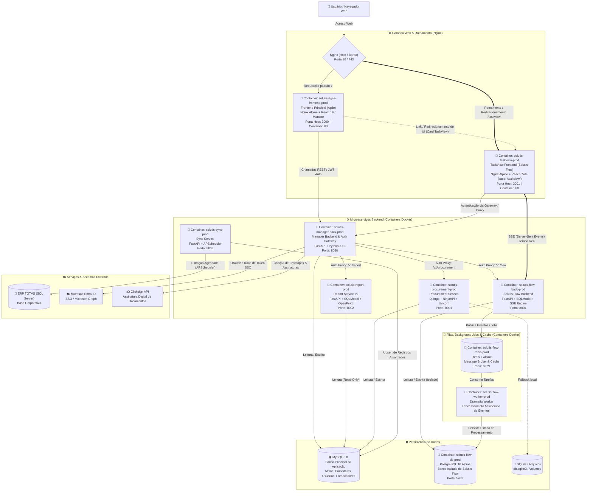

# Arquitetura do Sistema - Solutis Agile Monorepo

Este documento detalha a arquitetura técnica, os serviços conteinerizados via Docker, os fluxos de rede, os mecanismos de roteamento via Nginx com destaque para o **TaskView**, bem como os bancos de dados, filas, mensageria e integrações do ecossistema **Solutis Agile**.

---

## 🗺️ Diagrama de Arquitetura dos Serviços

---

## 📦 Serviços Conteinerizados (Docker Containers)

| Container | Imagem Base / Build | Porta Host : Container | Descrição e Papel |
| :--- | :--- | :--- | :--- |
| **`solutis-agile-frontend-prod`** | `nginx:alpine` (build React 19 / Mantine) | `3000:80` | Frontend principal servido via Nginx na raiz (`/`). |
| **`solutis-taskview-prod`** | `nginx:alpine` (build React / Vite) | `3001:80` | Frontend do TaskView (`solutis-flow`) compilado com base `/taskview/` e servido via Nginx. |
| **`solutis-manager-back-prod`** | Python 3.13 / FastAPI | `8080:8080` | API Central, Auth/Authz e Auth Proxy Gateway para os microsserviços. |
| **`solutis-procurement-prod`** | Python / Django / NinjaAPI | `8001:8001` | Gestão de compras, fornecedores e análise comparativa (FO-AD-01). |
| **`solutis-report-prod`** | Python 3.13 / FastAPI / SQLModel | `8002:8002` | Geração de relatórios (v2) em Excel (`.xlsx`) via consulta read-only. |
| **`solutis-sync-prod`** | Python 3.13 / FastAPI / APScheduler | `8003:8003` | Sincronização periódica do ERP TOTVS para o banco da aplicação. |
| **`solutis-flow-back-prod`** | Python 3.13 / FastAPI / SQLModel | `8004:8004` | Backend de governança e demandas com suporte a Server-Sent Events (SSE). |
| **`solutis-flow-worker-prod`** | Python 3.13 / Dramatiq | — (worker) | Worker assíncrono para processamento de eventos do Solutis Flow. |
| **`solutis-flow-redis-prod`** | `redis:7-alpine` | `6379:6379` | Broker de mensagens para o Dramatiq e cache/eventos do Flow. |
| **`solutis-flow-db-prod`** | `postgres:16-alpine` | `5432:5432` | Banco de dados PostgreSQL 16 isolado exclusivamente para o Flow. |

---

## 🔀 Provimento Frontend via Nginx & Roteamento TaskView

1. **Provimento por Nginx em Camadas**:
   - Cada frontend (`solutis-agile-frontend` e `solutis-flow`) é empacotado em uma imagem Docker com servidor web **Nginx (`nginx:alpine`)**, responsável por servir os arquivos estáticos e garantir o fallback SPA (`try_files $uri $uri/ /index.html`).
2. **Roteamento e Redirecionamento para o TaskView**:
   - O TaskView (`solutis-flow`) é compilado com base path `base: '/taskview/'` no `vite.config.ts`.
   - O Nginx de borda/reverso roteia requisições com o prefixo `/taskview` para o container `solutis-taskview-prod` (porta 3001), enquanto a rota raiz `/` vai para `solutis-agile-frontend-prod` (porta 3000).
   - No portal principal (`solutis-agile-frontend`), a variável de ambiente `VITE_FLOW_APP_URL=/taskview` viabiliza o redirecionamento direto dos usuários a partir do card interativo "Acessar Solutis TaskView".

---

## 🛢️ Bancos de Dados, Filas, Cache e Ferramentas do Ecossistema

- **Bancos de Dados**:
  - **MySQL 8.0**: Banco relacional central compartilhado pelo Manager Backend, Procurement, Report Service (leitura) e alvo de escrita do Sync Service.
  - **PostgreSQL 16 (`solutis-flow-db-prod`)**: Banco de dados relacional isolado do Solutis Flow para demandas, históricos e governança operacional.
  - **SQLite (`db.sqlite3`)**: Armazenamento local/fallback para dados operacionais e arquivos de fornecedores.
  - **ERP TOTVS (SQL Server)**: Banco legado corporativo externo acessado pelo Sync Service.
- **Filas & Background Jobs**:
  - **Dramatiq**: Framework de filas em Python executado no container dedicado `solutis-flow-worker-prod`.
  - **APScheduler**: Agendador de tarefas em segundo plano incorporado ao `solutis-sync-prod`.
- **Cache & Message Broker**:
  - **Redis 7 (`solutis-flow-redis-prod`)**: Broker oficial do Dramatiq e mecanismo de armazenamento temporário de eventos.
- **Transmissão em Tempo Real**:
  - **Server-Sent Events (SSE)**: Conexão unidirecional persistente entre `solutis_flow_back` e `solutis-flow` para sincronização em tempo real de cards Kanban, SLAs e notificações.
- **Integrações Externas**:
  - **Microsoft Entra ID (Azure AD)**: Autenticação SSO corporativa e consulta ao Microsoft Graph.
  - **Clicksign API**: Assinatura eletrônica de Termos de Responsabilidade e comodatos.
